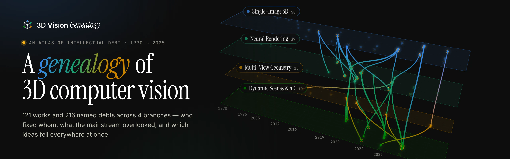
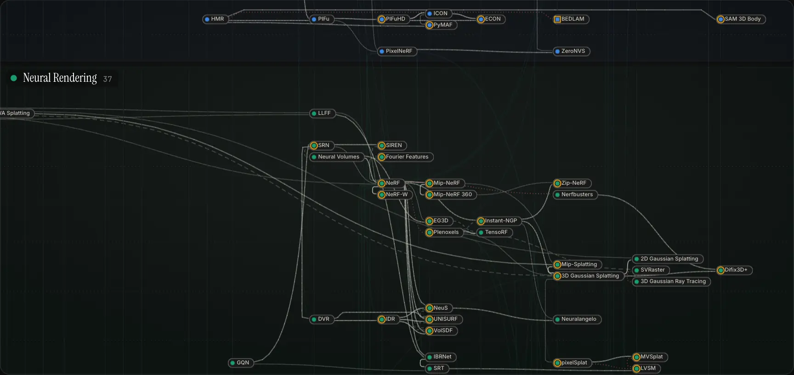
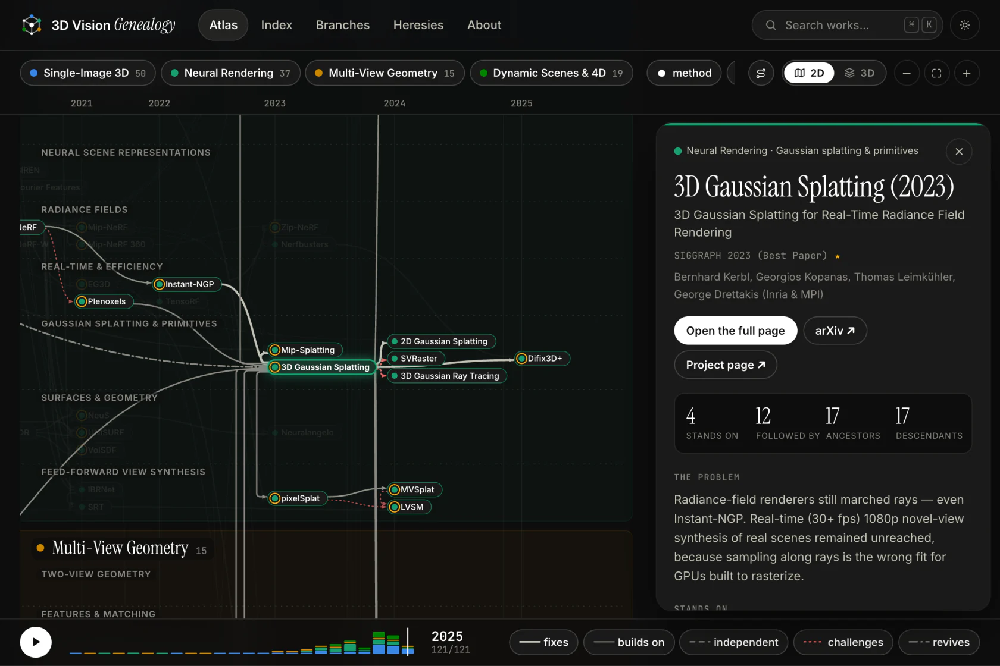
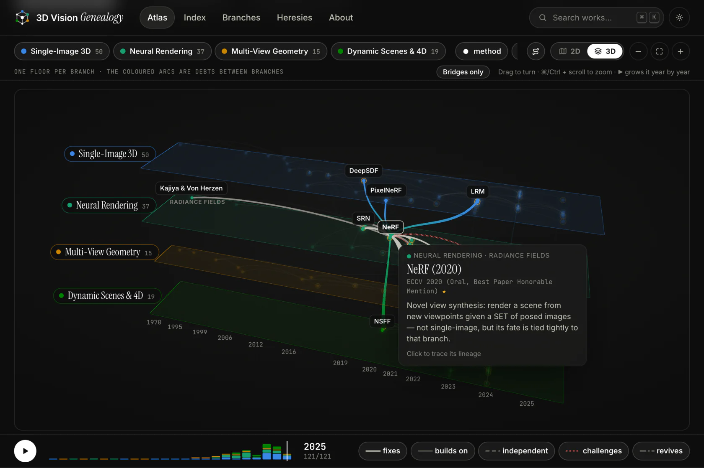
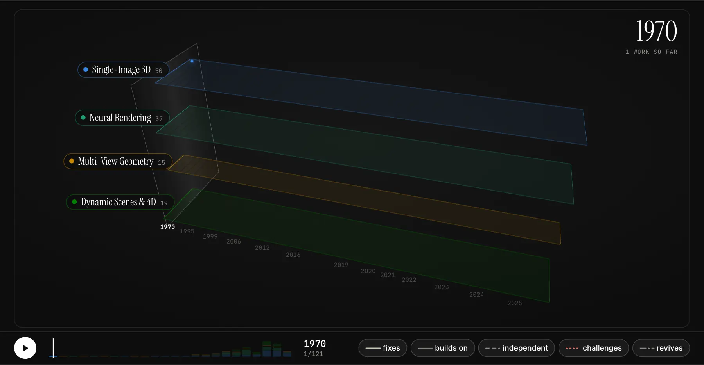
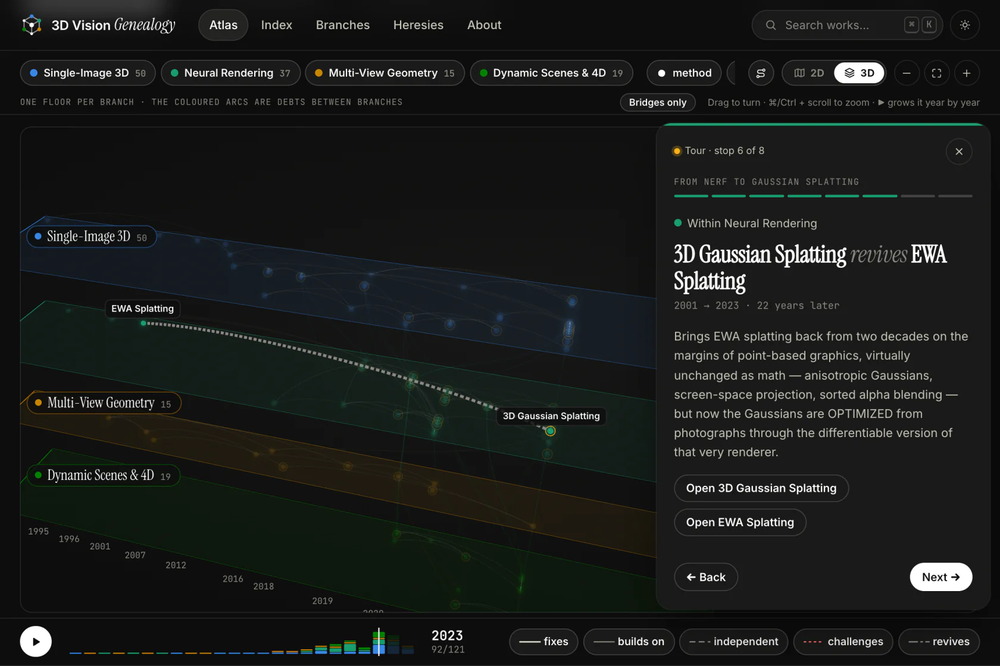
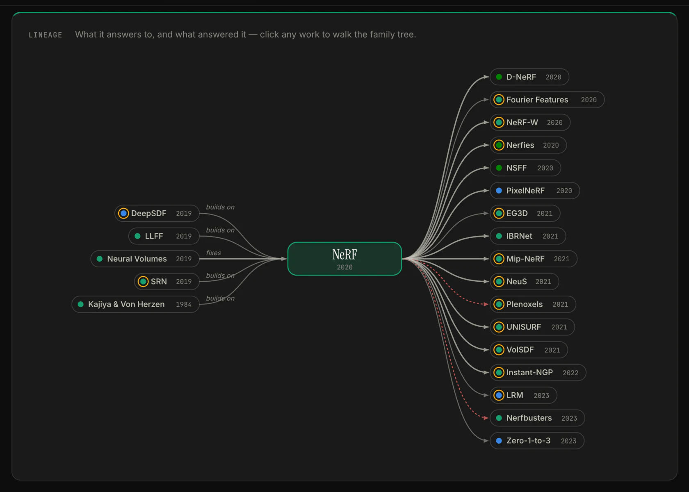
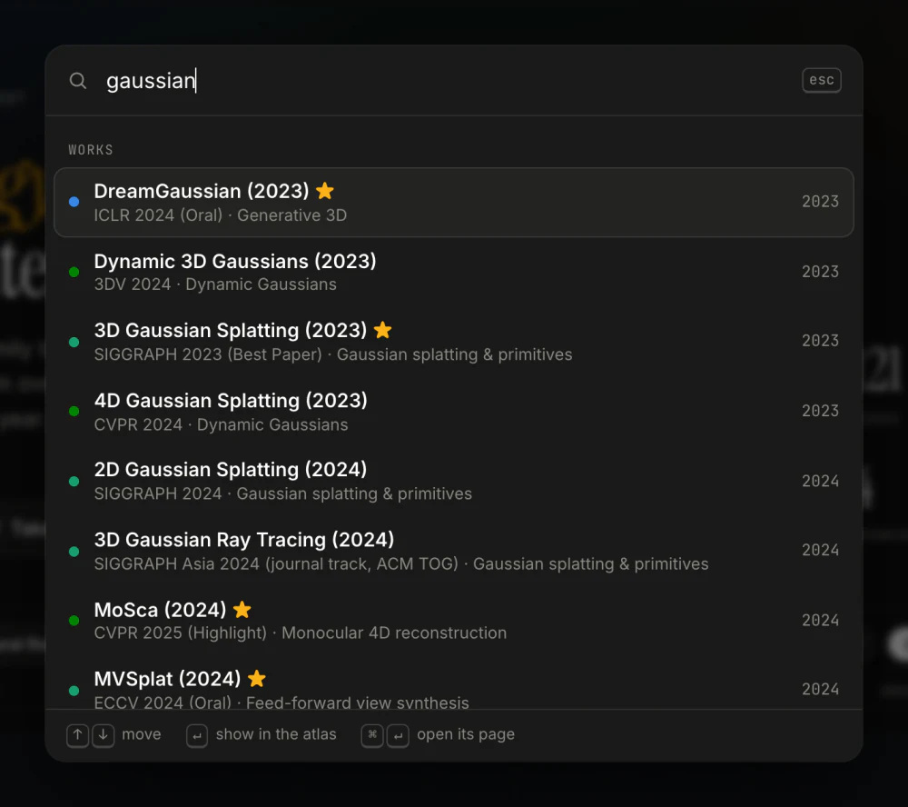
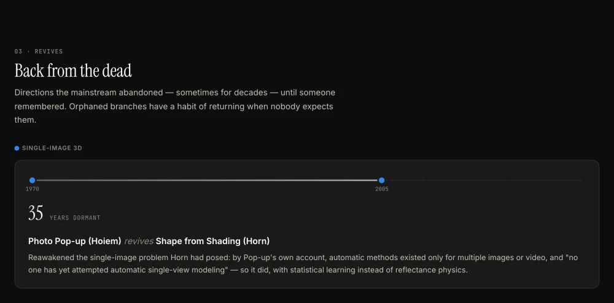

<picture>
  <source media="(prefers-color-scheme: dark)" srcset="docs/banner-dark.webp">
  <source media="(prefers-color-scheme: light)" srcset="docs/banner-light.webp">
  
</picture>

<p align="center">
  <a href="https://trdung22.github.io/3d-vision-genealogy/"><b>Open the atlas</b></a>
  &nbsp;·&nbsp;
  <a href="https://trdung22.github.io/3d-vision-genealogy/en/?tour=five-roads-into-nerf">Take a guided tour</a>
  &nbsp;·&nbsp;
  <a href="https://trdung22.github.io/3d-vision-genealogy/en/heresies/">Heresies</a>
  &nbsp;·&nbsp;
  <a href="https://trdung22.github.io/3d-vision-genealogy/en/works/">Index</a>
  &nbsp;·&nbsp;
  <a href="CONTRIBUTING.md">Contribute</a>
</p>

**Not another awesome-list.** Surveys give you a taxonomy but lose the story;
awesome-lists give you a warehouse but lose the order. Neither answers what a
learner actually needs to know: **why was this born, and what did it fix about
what came before it?** So this project records 3D computer vision as a
*genealogy* — every work a node, every edge an intellectual debt with a name.

<p align="center">
  
  <br>
  <sub>Hit <b>3D</b> and the map you are reading lifts off the page — every work keeps its place.</sub>
</p>

## Five words for intellectual debt

Every arrow runs forward in time, from an older work to a newer one that
answers it — and every arrow carries one of five names. The first two are the
usual story; the last three are the soul of the project, exactly what linear
write-ups drop on the floor.

| relation | meaning | for example |
|---|---|---|
| `fixes` | comes later and directly repairs a specific weakness of the earlier work | [Mip-NeRF](https://trdung22.github.io/3d-vision-genealogy/en/nodes/mipnerf2021/) *fixes* NeRF |
| `builds-on` | stands on the earlier work and extends it in a new direction | [NeRF](https://trdung22.github.io/3d-vision-genealogy/en/nodes/nerf2020/) *builds on* Kajiya & Von Herzen |
| `independent` | converges on the same core idea at the same time, without depending on the other — the task, even the branch, may differ | [DeepSDF](https://trdung22.github.io/3d-vision-genealogy/en/nodes/deepsdf2019/) and Occupancy Networks |
| `challenges` | questions the assumptions, benchmarks, or conclusions of the earlier work | [Tatarchenko et al.](https://trdung22.github.io/3d-vision-genealogy/en/nodes/tatarchenko2019/) *challenge* 3D-R2N2 |
| `revives` | reawakens a direction the mainstream had abandoned | [3D Gaussian Splatting](https://trdung22.github.io/3d-vision-genealogy/en/nodes/3dgs2023/) *revives* EWA splatting |

## What's inside

### Trace a lineage

Click any work and its whole family lights up — everything it stands on and
everything that descends from it, across branches — with its card in the
inspector. Hover to trace direct relations, click a relation to read its whole
note, filter by branch, by kind of work or by kind of debt. Every view is a
link you can share:
[`?focus=3dgs2023`](https://trdung22.github.io/3d-vision-genealogy/en/?focus=3dgs2023).



### Lift it into 3D

The same map, one glass floor per branch. The debts that cross from one
branch into another — faint lines on the flat map — become bridges between
floors, coloured from one branch into the other. Drag to turn it, hover a work
to light its relations, or keep only the bridges:
[`?view=3d`](https://trdung22.github.io/3d-vision-genealogy/en/?view=3d).



### Watch the field grow

The time bar replays the genealogy year by year. In 3D the building grows:
works arrive on their floors, relations draw themselves from the older work
to the newer, and a pane of light sweeps through time
([`?view=3d&year=2020`](https://trdung22.github.io/3d-vision-genealogy/en/?view=3d&year=2020)).



### Take a guided tour

Walks through recorded debts, one relation at a time. Each stop rewinds the
years to its moment, and every word on it comes from the works and the notes
on their relations:
[*Five roads into NeRF*](https://trdung22.github.io/3d-vision-genealogy/en/?tour=five-roads-into-nerf)
and
[*From NeRF to Gaussian splatting*](https://trdung22.github.io/3d-vision-genealogy/en/?tour=from-nerf-to-gaussians).



### A page for every work

Its family drawn as a tree, the problem → idea → what-it-left-open story, and
every debt in both directions — like
[NeRF's](https://trdung22.github.io/3d-vision-genealogy/en/nodes/nerf2020/).



<table>
  <tr>
    <td width="50%" valign="top">
      
      <p><b>⌘K from anywhere</b> — jump to any work, author, venue or branch.</p>
    </td>
    <td width="50%" valign="top">
      
      <p><b><a href="https://trdung22.github.io/3d-vision-genealogy/en/heresies/">Heresies, rivalries & revivals</a></b> — generated entirely from the edges: who proved a branch was fooling itself, which ideas landed everywhere at once, and what came back from the dead.</p>
    </td>
  </tr>
</table>

## The genealogy so far

**121 works, 1970 → 2025**, across four full branches:

- **Single-image 3D reconstruction** — the most classically ill-posed problem of all.
- **Neural rendering** — 1984 volume rendering → light fields → NeRF → 3DGS → the post-3D-bias era.
- **Multi-view geometry** — the 1981 essential matrix → SIFT → COLMAP → learned matching → DUSt3R → VGGT.
- **Dynamic scenes & 4D** — deformation fields → scene flow → spacetime planes → dynamic Gaussians → 4D from a single casual video.

Gold rings mark award / oral / spotlight recognition, verified against
official sources; the mark's shape tells methods (●) from analyses (◆) and
datasets (■).

## How it works

An [Astro 5](https://astro.build) static site: a D3-drawn atlas that lifts into
three.js 3D. The whole genealogy is **data, not code** — one YAML file per work,
one per branch, one per tour. Every page, the atlas (flat and 3D) and the tours
are generated from it at build time, so adding a paper, or grafting an entire
new branch, is just adding files:

```yaml
# src/content/nodes/<id>.yaml
title: "NeRF: Representing Scenes as Neural Radiance Fields for View Synthesis"
short: "NeRF (2020)"
venue: "ECCV 2020 (Oral, Best Paper Honorable Mention)"   # ⇒ gold ring, automatically
year: 2020
branch: neural-rendering
lane: radiance-fields
problem: >
  Novel view synthesis: render a scene from new viewpoints...
relations:
  - node: deepsdf2019
    type: builds-on
    note: >
      Inherits the continuous implicit-MLP representation and adds
      differentiable volume rendering — the bridge between two branches.
```

## Run it locally

```bash
npm install
npm run dev        # http://localhost:4321/3d-vision-genealogy/
```

## Contributing

Spotted a missing node, a wrong relation, or an orphaned research direction
nobody has told? Issues and PRs are very welcome — the authoring guide
(node, branch and tour templates, lane & color conventions, editorial
principles) lives in [CONTRIBUTING.md](CONTRIBUTING.md).

## Roadmap

- [ ] First deep-dive posts (candidates: Eigen 2014, or the Tatarchenko 2019 "challenges" moment)
- [x] Open the full neural-rendering branch (80s volume rendering → light fields → SRN → NeRF → 3DGS → LVSM)
- [x] Open the multi-view geometry branch (two-view geometry → SIFT → Photo Tourism → COLMAP → learned matching → DUSt3R → VGGT)
- [x] Open the dynamic scenes & 4D branch (D-NeRF / Nerfies → HyperNeRF, NSFF → DynIBaR, HexPlane / K-Planes → 4D-GS, PIPs → TAPIR / CoTracker → Shape of Motion / MoSca, MonST3R → MegaSaM, MAV3D → CAT4D)
- [x] The atlas redesign: lineage tracing, ⌘K search, a family tree on every work's page, an index, a social card
- [x] The atlas in 3D and 4D: one floor per branch, bridges between them, the years growing the building
- [x] Guided tours through the graph (story mode) — two so far; more welcome (see CONTRIBUTING)
- [ ] RSS feed + per-page Open Graph cards
