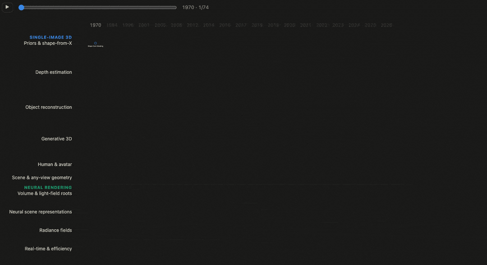
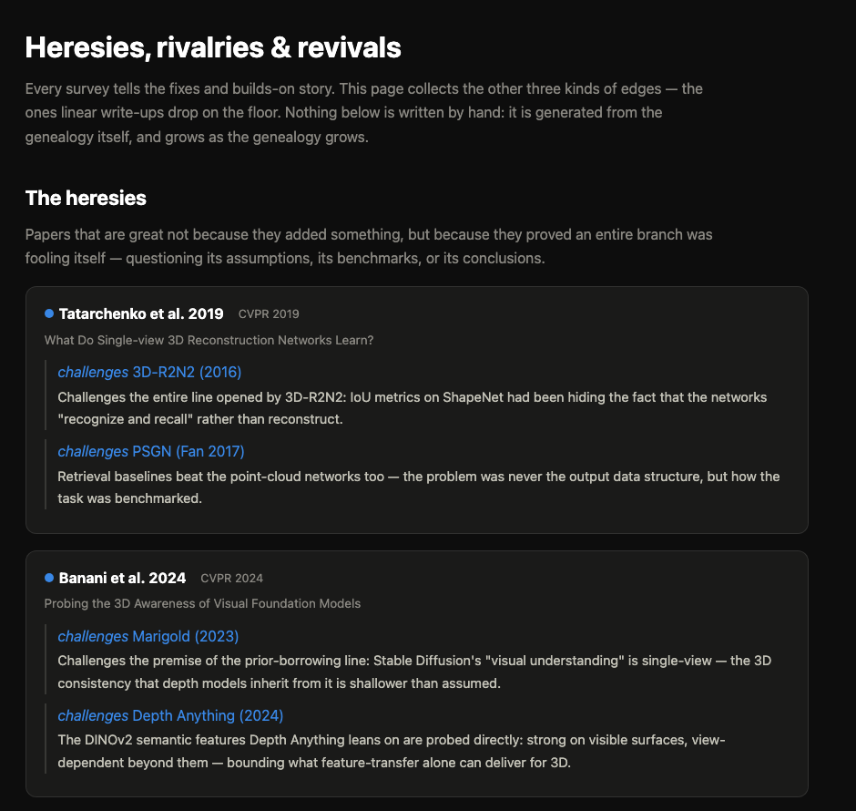
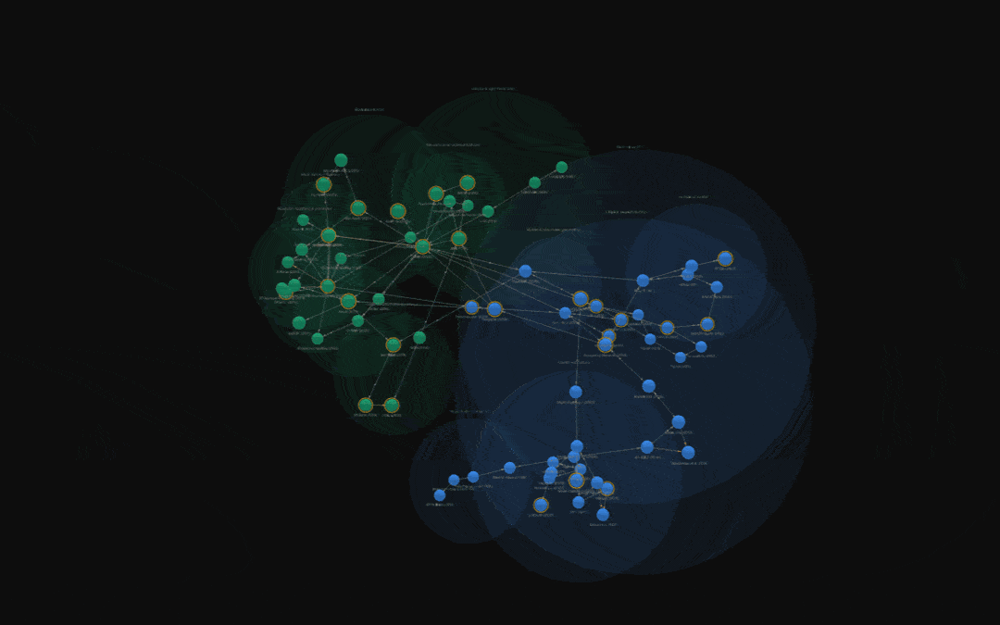

<div align="center">

# 3D Vision Genealogy

**Not another awesome-list.** A genealogy of 3D computer vision — who fixed whom,
what the mainstream overlooked, and which branches quietly solved
the same problem in parallel.

**[Explore the live site →](https://trdung22.github.io/3d-vision-genealogy/)**

English · 日本語 — dark & light

</div>

[](https://trdung22.github.io/3d-vision-genealogy/)

## The idea

Surveys give you a taxonomy but lose the story. Awesome-lists give you a
warehouse but lose the order. Neither answers the question a learner actually
needs: **why was this born, and what did it fix about what came before it?**

So this project records the field as a *genealogy*: every work is a node, and
every edge is an intellectual debt with an explicit name —

| relation | meaning |
|---|---|
| `fixes` | comes later and directly repairs a specific weakness of the earlier work |
| `builds-on` | stands on the earlier work and extends it in a new direction |
| `independent` | converges on the same core idea at the same time, without depending on the other — the task, even the branch, may differ |
| `challenges` | questions the assumptions, benchmarks, or conclusions of the earlier work |
| `revives` | reawakens a direction the mainstream had abandoned |

The last three are the soul of the project — they are exactly what linear
write-ups drop on the floor.

## What's inside

- **An interactive timeline DAG** — hover a node to trace its direct relations,
  and drag the **time-machine slider** (or hit ▶) to replay the field year by
  year. Snapshots are shareable: [`?year=2005`](https://trdung22.github.io/3d-vision-genealogy/en/?year=2005).
- **The same genealogy in 3D** — a force graph with nodes clustered by research lane.
- **[Heresies, rivalries & revivals](https://trdung22.github.io/3d-vision-genealogy/en/heresies/)** —
  a page generated *entirely* from the graph's edges: who proved an entire
  branch was fooling itself, which ideas landed everywhere at once
  (the 2019 implicit wave!), and what came back from the dead decades later.
- **88 works, 1970 → 2025**, across two full branches: **single-image 3D
  reconstruction** (the most classically ill-posed problem of all) and
  **neural rendering** (1984 volume rendering → light fields → NeRF → 3DGS →
  the post-3D-bias era). Gold rings mark award / oral / spotlight recognition,
  verified against official sources; the mark's shape tells methods (●) from
  analyses (◆) and datasets (■).

<table>
  <tr>
    <td width="52%"></td>
    <td></td>
  </tr>
  <tr>
    <td align="center"><sub>The heresies page — generated from the edges, never written by hand</sub></td>
    <td align="center"><sub>The same genealogy in 3D</sub></td>
  </tr>
</table>

## How it works

An [Astro 5](https://astro.build) static site (D3 timeline + three.js force
graph). The whole genealogy is **data, not code**: one YAML file per work, one
per branch. Every page and both graphs are generated from it at build time —
adding a paper, or grafting an entire new branch, is just adding files:

```yaml
# src/content/nodes/<id>.yaml
title: "NeRF: Representing Scenes as Neural Radiance Fields for View Synthesis"
short: "NeRF (2020)"
venue: "ECCV 2020 (Oral, Best Paper Honorable Mention)"   # ⇒ gold ring, automatically
year: 2020
branch: neural-rendering
lane: radiance-fields
problem: >
  Novel view synthesis: render a scene from new viewpoints...
relations:
  - node: deepsdf2019
    type: builds-on
    note: >
      Inherits the continuous implicit-MLP representation and adds
      differentiable volume rendering — the bridge between two branches.
```

## Run it locally

```bash
npm install
npm run dev        # http://localhost:4321/3d-vision-genealogy/
```

## Contributing

Spotted a missing node, a wrong relation, or an orphaned research direction
nobody has told? Issues and PRs are very welcome — the authoring guide
(node/branch templates, lane & color conventions, editorial principles) lives
in [CONTRIBUTING.md](CONTRIBUTING.md).

## Roadmap

- [ ] First deep-dive posts (candidates: Eigen 2014, or the Tatarchenko 2019 "challenges" moment)
- [x] Open the full neural-rendering branch (80s volume rendering → light fields → SRN → NeRF → 3DGS → LVSM)
- [ ] Guided tours through the graph (story mode)
- [x] Localize node content for `/ja/`
- [ ] RSS feed + Open Graph images
