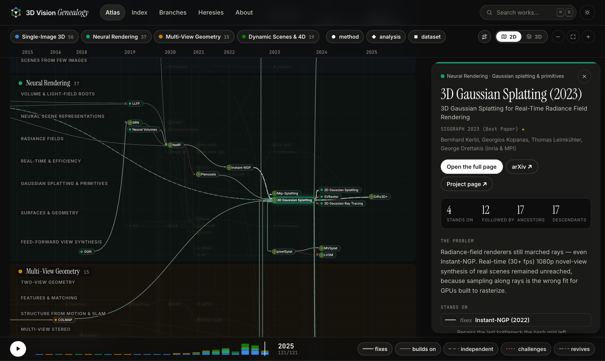
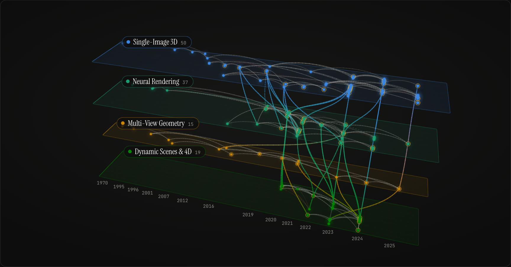

<div align="center">

# 3D Vision Genealogy

**Not another awesome-list.** A genealogy of 3D computer vision — who fixed whom,
what the mainstream overlooked, and which branches quietly solved
the same problem in parallel.

**[Explore the live site →](https://trdung22.github.io/3d-vision-genealogy/)**

English — dark & light

</div>

[](https://trdung22.github.io/3d-vision-genealogy/)

## The idea

Surveys give you a taxonomy but lose the story. Awesome-lists give you a
warehouse but lose the order. Neither answers the question a learner actually
needs: **why was this born, and what did it fix about what came before it?**

So this project records the field as a *genealogy*: every work is a node, and
every edge is an intellectual debt with an explicit name —

| relation | meaning |
|---|---|
| `fixes` | comes later and directly repairs a specific weakness of the earlier work |
| `builds-on` | stands on the earlier work and extends it in a new direction |
| `independent` | converges on the same core idea at the same time, without depending on the other — the task, even the branch, may differ |
| `challenges` | questions the assumptions, benchmarks, or conclusions of the earlier work |
| `revives` | reawakens a direction the mainstream had abandoned |

The last three are the soul of the project — they are exactly what linear
write-ups drop on the floor.

## What's inside

- **The atlas** — the genealogy as a timeline map: every work a capsule on a
  compressed time axis, one lane per research thread, every relation flowing
  left to right. **Click a work to light up its whole lineage** — everything
  it stands on and everything that descends from it — with its card in the
  inspector; hover to trace direct relations; filter branches, kinds of work
  and kinds of relation; hit ▶ to replay the field year by year. Every view
  is a shareable URL: [`?focus=nerf2020`](https://trdung22.github.io/3d-vision-genealogy/en/?focus=nerf2020),
  [`?year=2005`](https://trdung22.github.io/3d-vision-genealogy/en/?year=2005).
- **⌘K search** — jump to any work, author, venue or branch from any page.
- **A page per work** — its immediate family drawn as a small tree, the
  problem → idea → what-it-left-open story, and every debt in both directions.
- **The same atlas in 3D — and 4D.** Hit **3D** and the map you are reading
  lifts off the page: the capsules collapse into beads and each branch rises
  onto its own glass floor (every work keeps its place), so every debt that
  crosses between branches becomes a bridge between floors. Press ▶ there and
  the building grows year by year — works arrive on their floors, relations
  draw themselves from the older work to the newer, a pane of light sweeps
  through time and the camera travels with it
  ([`?view=3d`](https://trdung22.github.io/3d-vision-genealogy/en/?view=3d)).
- **Guided tours** — walks through recorded debts, one relation at a time:
  [*Five roads into NeRF*](https://trdung22.github.io/3d-vision-genealogy/en/?tour=five-roads-into-nerf)
  and [*From NeRF to Gaussian splatting*](https://trdung22.github.io/3d-vision-genealogy/en/?tour=from-nerf-to-gaussians).
  Each stop rewinds the years to its moment; every word on it comes from the
  works and the notes on their relations.
- **[An index](https://trdung22.github.io/3d-vision-genealogy/en/works/)** — every work as one searchable, sortable list.
- **[Heresies, rivalries & revivals](https://trdung22.github.io/3d-vision-genealogy/en/heresies/)** —
  a page generated *entirely* from the graph's edges: who proved an entire
  branch was fooling itself, which ideas landed everywhere at once
  (the 2019 implicit wave!), and what came back from the dead decades later.
- **121 works, 1970 → 2025**, across four full branches: **single-image 3D
  reconstruction** (the most classically ill-posed problem of all),
  **neural rendering** (1984 volume rendering → light fields → NeRF → 3DGS →
  the post-3D-bias era), **multi-view geometry** (the 1981 essential matrix →
  SIFT → COLMAP → learned matching → DUSt3R → VGGT) and **dynamic scenes &
  4D** (deformation fields → scene flow → spacetime planes → dynamic
  Gaussians → 4D from a single casual video). Gold rings mark award / oral / spotlight recognition,
  verified against official sources; the mark's shape tells methods (●) from
  analyses (◆) and datasets (■).

<table>
  <tr>
    <td width="52%"></td>
    <td></td>
  </tr>
  <tr>
    <td align="center"><sub>The heresies page — generated from the edges, never written by hand</sub></td>
    <td align="center"><sub>The same atlas, lifted — one floor per branch, bridges for the debts between them</sub></td>
  </tr>
</table>

## How it works

An [Astro 5](https://astro.build) static site (a D3-drawn atlas that lifts into
three.js 3D). The whole genealogy is **data, not code**: one YAML file per work,
one per branch, one per tour. Every page, the atlas (flat and 3D) and the tours
are generated from it at build time — adding a paper, or grafting an entire new
branch, is just adding files:

```yaml
# src/content/nodes/<id>.yaml
title: "NeRF: Representing Scenes as Neural Radiance Fields for View Synthesis"
short: "NeRF (2020)"
venue: "ECCV 2020 (Oral, Best Paper Honorable Mention)"   # ⇒ gold ring, automatically
year: 2020
branch: neural-rendering
lane: radiance-fields
problem: >
  Novel view synthesis: render a scene from new viewpoints...
relations:
  - node: deepsdf2019
    type: builds-on
    note: >
      Inherits the continuous implicit-MLP representation and adds
      differentiable volume rendering — the bridge between two branches.
```

## Run it locally

```bash
npm install
npm run dev        # http://localhost:4321/3d-vision-genealogy/
```

## Contributing

Spotted a missing node, a wrong relation, or an orphaned research direction
nobody has told? Issues and PRs are very welcome — the authoring guide
(node/branch templates, lane & color conventions, editorial principles) lives
in [CONTRIBUTING.md](CONTRIBUTING.md).

## Roadmap

- [ ] First deep-dive posts (candidates: Eigen 2014, or the Tatarchenko 2019 "challenges" moment)
- [x] Open the full neural-rendering branch (80s volume rendering → light fields → SRN → NeRF → 3DGS → LVSM)
- [x] Open the multi-view geometry branch (two-view geometry → SIFT → Photo Tourism → COLMAP → learned matching → DUSt3R → VGGT)
- [x] Open the dynamic scenes & 4D branch (D-NeRF / Nerfies → HyperNeRF, NSFF → DynIBaR, HexPlane / K-Planes → 4D-GS, PIPs → TAPIR / CoTracker → Shape of Motion / MoSca, MonST3R → MegaSaM, MAV3D → CAT4D)
- [x] The atlas redesign: lineage tracing, ⌘K search, a family tree on every work's page, an index, a social card
- [x] The atlas in 3D and 4D: one floor per branch, bridges between them, the years growing the building
- [x] Guided tours through the graph (story mode) — two so far; more welcome (see CONTRIBUTING)
- [ ] RSS feed + per-page Open Graph cards
